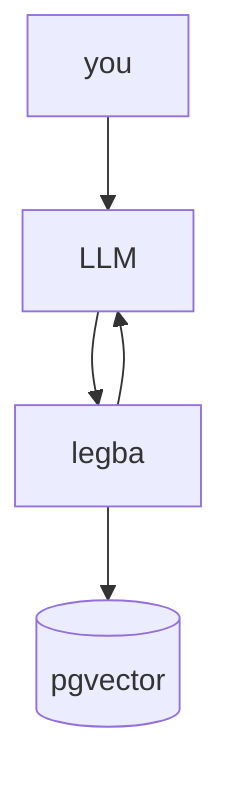
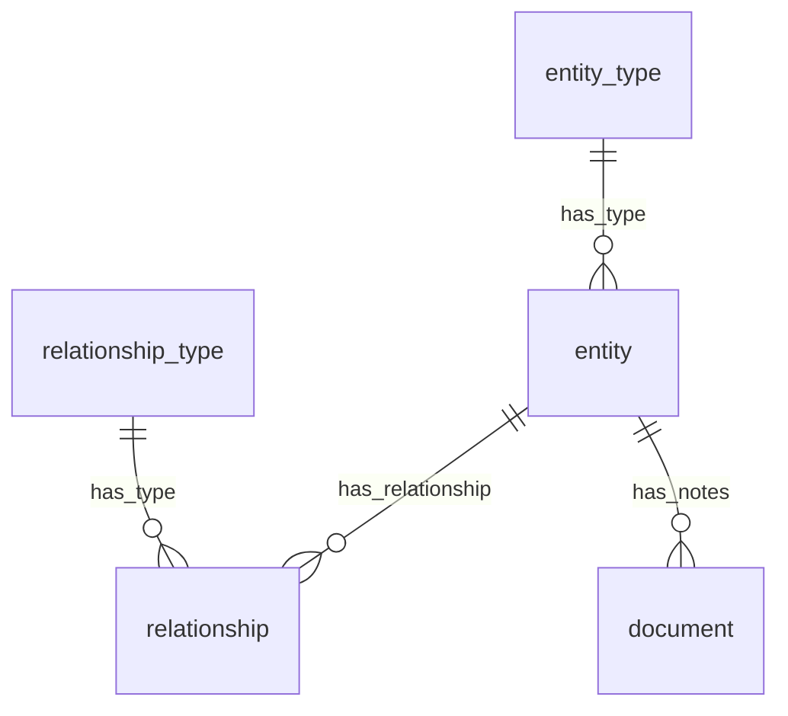

# legba

<picture>
  <source
    srcset="doc/legba-logo.png"
    media="(orientation: portrait)" />
  
</picture>
legba is my attempt at creating an MCP server that allows your LLM to learn as you use it.

## Overview

At a high level, it is a combination of a graph database that stores entities and relationships,
and a document store that allows exposing and interacting with the graph database through a
file-like API.

## Architecture

The infrastructure looks like this:

The data is stored like this:

## AI Disclaimer

This project does use AI to generate code, because I believe it's necessary to dogfood your own product.

The overall architecture is human-designed.
AI code is reviewed, and the dominant use is for documentation and unit testing, but AI is used.
The AI prompts are generally small and targeted ("write a function that does X", "add comments to Y in the following format...").