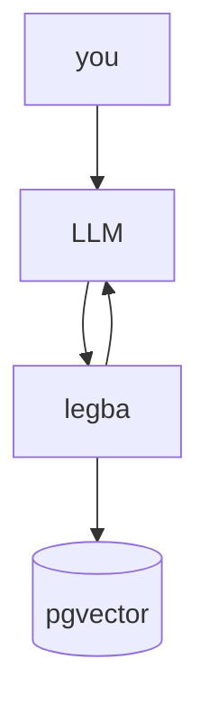

# legba

<picture>
  <source
    srcset="doc/legba-logo.png"
    media="(orientation: portrait)" />
  
</picture>
legba is my attempt at creating an MCP server that allows your LLM to learn as you use it.

## Overview

At a high level, it is a combination of a graph database that stores entities and relationships,
and a document store that allows exposing and interacting with the graph database through a
file-like API.

## Architecture

## AI Disclaimer

AI is used in this project, however primarily for unit testing (that likely
would not exist otherwise, because I am a bad test writer).

All code in this repo has been thoroughly human-reviewed, and the vast
majority of code in the binaries is human-written.  If I find an AI workflow
I like, I will update this, but as of now I am not a fan of the results of
agentic AI on substantial codebases that need strong data consistency guarantees.